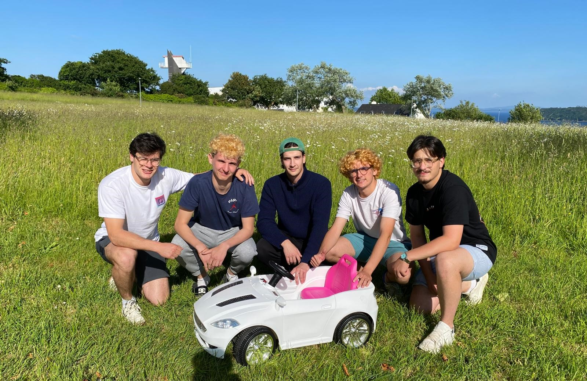

# Lane-Following System for Autonomous Vehicle

This project implements a line detection and lane-following system for an autonomous vehicle, using a Raspberry Pi, a camera, and computer vision algorithms.

## Description

The system uses computer vision to detect road lane markings, compute the relative position of the vehicle, and adjust its steering accordingly. It is designed to be robust to changing lighting conditions and partial line detections.

### The team and the prototype used to test the onboard autonomous driving system



### Main features

- Real-time detection of road lanes
- Support for single- or dual-camera configuration
- Interactive adjustment of detection parameters
- Resilience mechanisms to maintain tracking in case of partial detection
- Proportional steering motor control

## System architecture

The system is organized into several modules:

1. **Camera module**: Image acquisition via the Raspberry Pi camera
2. **Detection module**: Image processing and lane detection
3. **Decision module**: Analysis of lines to determine vehicle position
4. **Motor module**: Steering motor control based on decisions

## Installation

### Prerequisites

- Raspberry Pi 3 or newer
- Pi Camera or compatible USB camera
- Motor and appropriate driver circuitry
- Python 3.7+
- OpenCV 4.x

### Dependencies

Install the required dependencies:

```bash
pip install opencv-python numpy picamera2
```

### Hardware setup

1. Connect the camera to the Raspberry Pi
2. Connect the motor to the GPIO pins as follows:
   - EN to GPIO 18
   - IN1 to GPIO 20
   - IN2 to GPIO 16

## Usage

### Basic configuration

1. Clone the repository:
   ```bash
   git clone https://gitlab-df.imt-atlantique.fr/pronto/code-suivi-de-2-lignes.git
   cd code-suivi-de-2-lignes
   ```

2. Run the main program:
   ```bash
   python main.py
   ```

### Parameter adjustment

To adjust lane detection parameters in real time:

```bash
python main.py --show_visuals --adjust_parameters
```

The optimized parameters will be saved to `single_camera_config.json` and automatically reused for subsequent runs.

### Advanced configuration

Different options are available:

- Dual-camera mode: `python main.py --dual_camera`
- Visualization of detections: `python main.py --show_visuals`
- Debug mode: `python main.py --debug`

## File structure

```markdown
.
├── camera_module.py              # Module for image acquisition
├── detection_module.py           # Module for lane detection
├── decision_module.py            # Module for decision making
├── motor_module.py               # Module for motor control
├── config/                       # Folder for configuration files
│   ├── single_camera_config.json # Single-camera configuration
│   └── dual_camera_config.json   # Dual-camera configuration
├── logs/                         # Folder for log files
└── main.py                       # Main entry point of the program
```

## Changelog

See the `CHANGELOG.md` file for a complete history of changes.

## Authors and acknowledgements

- Loïc Fournier (project lead, electronics)
- Antoine Jourdain (electronics)
- Daniélou Titouan (computer science)
- Dode Nicolas (computer science)
- Fontan Julien (computer science)

Special thanks to Professor Christophe Lohr from the Computer Science Department at IMT Atlantique for supporting us throughout this project.

## License

This project is licensed under the MIT License.
